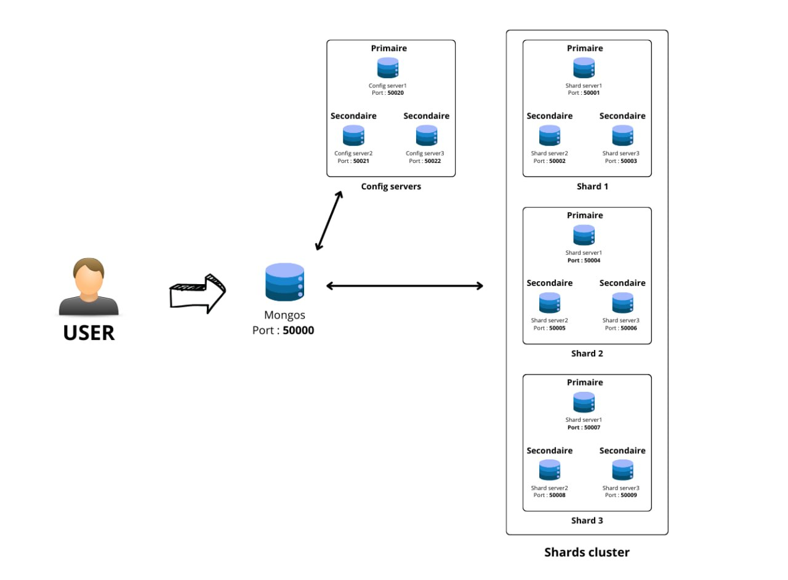

# Projet : Atelier MongoDB Cluster & Replica Set

Ce projet vise à configurer un cluster MongoDB avec un Replica Set et du sharding en utilisant Docker et PowerShell. Il est conçu pour être facilement déployé et utilisé dans un environnement local à des fins de tests et de développement.

Voici l'architecture utilisée dans cette configuration :




## Prérequis

Avant de commencer, assurez-vous que les outils suivants sont installés et configurés sur votre machine :

- **Docker** : Assurez-vous que Docker est installé et en cours d'exécution sur votre machine. [Télécharger Docker](https://www.docker.com/get-started)
- **PowerShell** : Utilisez PowerShell en tant qu'administrateur pour exécuter les scripts nécessaires.

## Installation

### Étapes pour démarrer le projet :

1. **Clonez le repository** :

   Clonez ce repository GitHub sur votre machine locale :

   ```bash
   git clone https://github.com/Josef3215/atelier_1-.git
   cd votre-repository
2. **Téléchargez les données** :

   Vous devez télécharger manuellement les données depuis ce lien Google Drive et les placer dans le répertoire du projet actuel (`atelier_1-`) :

   [Télécharger les données depuis Google Drive](https://drive.google.com/drive/folders/14wJMdajvWW6JX4qn6c0ACIOZ1ZyKhJuZ?usp=sharing)

   Après avoir téléchargé les données, assurez-vous de les déplacer dans le dossier du projet pour que le processus d'initialisation puisse les utiliser.


3. **Démarrez l'environnement Docker :**
   Lancez les services définis dans le fichier `docker-compose.yml` (Replica Set et Sharding) :

   ```bash
   docker-compose up -d

4. **Configurer PowerShell :**

   Ouvrez PowerShell en tant qu'administrateur et accédez au dossier du projet. Suivez ces étapes :

   1. **Ouvrir PowerShell en tant qu'administrateur** :
      - Cliquez avec le bouton droit sur l'icône PowerShell et sélectionnez **"Exécuter en tant qu'administrateur"**.
      - Si vous utilisez Windows 10 ou une version plus récente, vous pouvez rechercher "PowerShell" dans le menu Démarrer, puis faire un clic droit pour choisir "Exécuter en tant qu'administrateur".

   2. **Accédez au dossier du projet** :
      Dans PowerShell, utilisez la commande `cd` pour vous rendre dans le répertoire où se trouve votre projet. Par exemple :

      ```bash
      cd C:\chemin\vers\votre\projet
      ```

   3. **Modifier la politique d'exécution des scripts** :
      PowerShell empêche par défaut l'exécution de scripts téléchargés à des fins de sécurité. Pour permettre l'exécution de ces scripts, vous devez modifier la politique d'exécution en utilisant la commande suivante :

      ```bash
      Set-ExecutionPolicy RemoteSigned
      ```

      - **RemoteSigned** : Cette option permet d'exécuter les scripts locaux sans restrictions, tout en exigeant que les scripts téléchargés depuis Internet soient signés par un éditeur de confiance. Cela est nécessaire pour exécuter le script `inist.ps1` téléchargé depuis GitHub ou d'autres sources externes.
      
      - Lorsque vous exécutez cette commande, PowerShell peut vous demander une confirmation. Tapez `Y` pour accepter.

   4. **Vérification de la politique d'exécution** :
      Vous pouvez vérifier que la politique d'exécution a bien été modifiée en utilisant la commande suivante :

      ```bash
      Get-ExecutionPolicy
      ```

      Cette commande devrait renvoyer `RemoteSigned`, ce qui signifie que vous pouvez maintenant exécuter des scripts téléchargés.
      ---
      **Remarque importante** : Si vous ne souhaitez pas que cette politique soit permanente ou si vous travaillez sur une machine partagée, vous pouvez rétablir la politique d'exécution par défaut après l'exécution des scripts en utilisant la commande :
      ```bash
      Set-ExecutionPolicy Restricted 
      ```

---
  
 5. **Exécuter le script d'initialisation**

   Une fois l'environnement Docker configuré et PowerShell prêt, vous devez exécuter le script `inist.ps1` pour configurer MongoDB, charger les données shardées et initialiser le cluster.

   Pour exécuter le script, ouvrez PowerShell dans le dossier du projet et tapez la commande suivante :
   ```bash
   .\inist.ps1
   ```

Important : Pendant l'exécution du script, il est possible que le service mongos ne soit pas encore prêt à répondre aux requêtes. Si vous rencontrez un problème où le script semble ne pas avancer ou affiche une erreur concernant mongos, il est conseillé d'arrêter le script, de patienter un peu pour que les services soient prêts, puis de relancer le script à partir de la même commande 

 6. **Vérification du Cluster MongoDB**

   Une fois le script d'initialisation exécuté, vous pouvez vérifier si le cluster MongoDB fonctionne correctement en vous connectant à l'instance `mongos` et en effectuant une vérification de la distribution des shards.

   Pour ce faire, exécutez la commande suivante pour entrer dans le conteneur MongoDB `mongos` :

   ```bash
   
    docker exec -it mongos mongo
    use atelier1 
    db.table_entropot.getShardDistribution()
   ```


